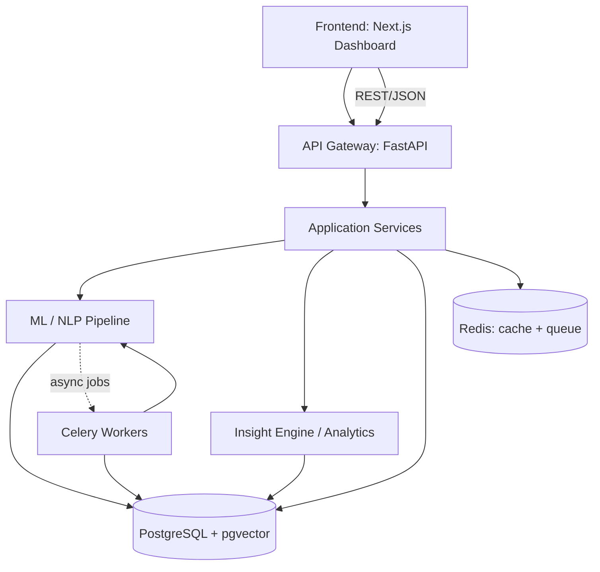
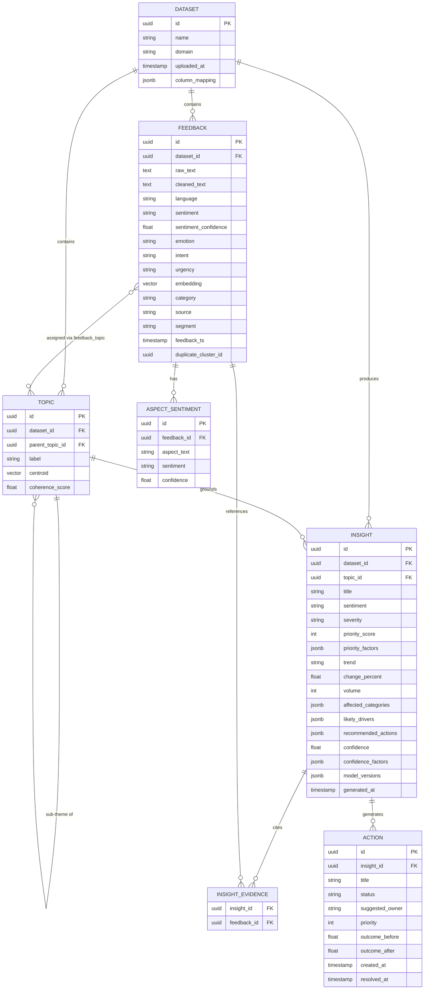
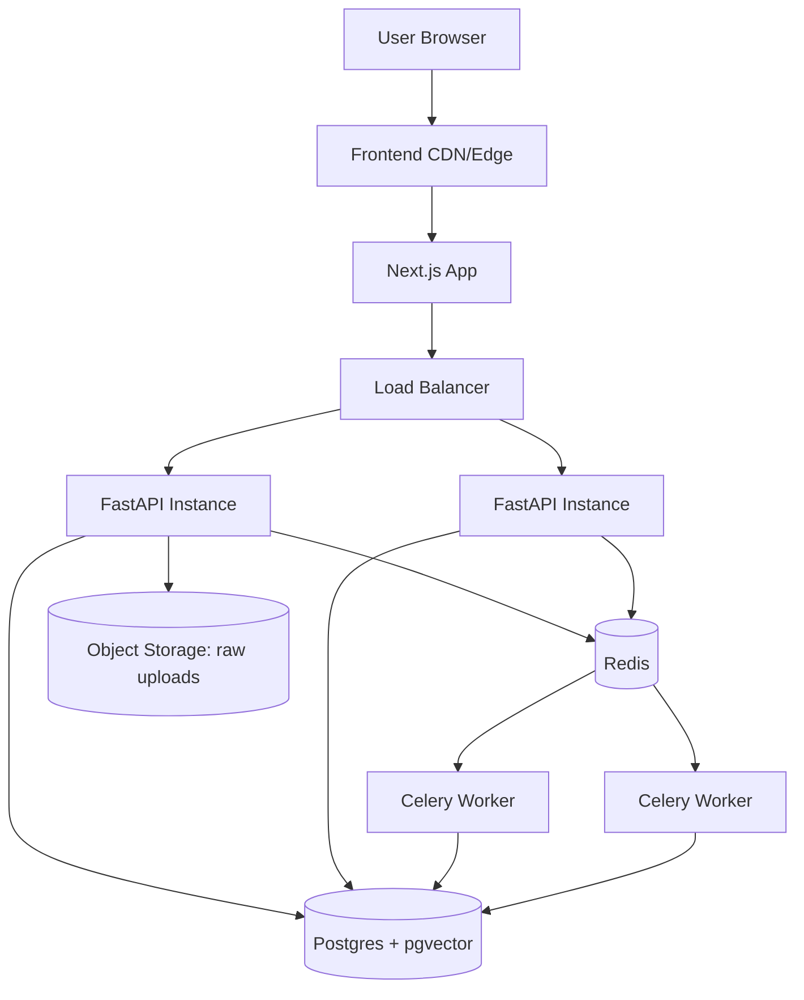
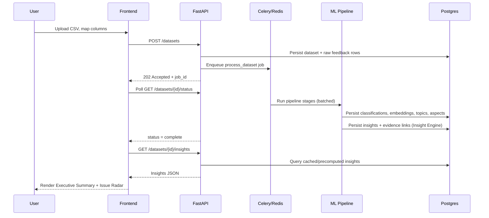
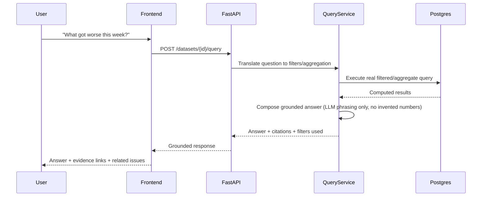

# ARCHITECTURE.md — Feedback Intelligence OS

## 1. Current Architecture Audit (Rereflect)
```
┌─────────────────┐
│  frontend-web   │  Next.js 16 + TypeScript + TailwindCSS
└────────┬────────┘
         │ REST API
         ▼
┌─────────────────┐
│   backend-api   │  FastAPI + PostgreSQL + SQLAlchemy
└────────┬────────┘
    ┌────┴────┐
    ▼         ▼
┌────────┐ ┌────────────┐
│analysis│ │  worker-   │  Celery + Redis
│-engine │ │  service   │
└────────┘ └────────────┘
```
Four services, JWT-authenticated multi-tenant API, VADER/scikit-learn/BERTopic analysis engine with optional LLM (BYOK). This is a sound, working reference architecture — retained as the base shape (§2). What it lacks relative to PS1: an Insight Engine layer with explainable priority scoring, a structured evidence object (vs. a feedback-list drill-down), aspect-level sentiment, emerging-issue statistical gating, and a vector store.

## 2. System Overview (Target)
FIOS ingests a batch feedback dataset (CSV), runs it through a layered NLP pipeline, and produces structured, evidence-linked insights consumed by a dashboard. Every layer has a single responsibility; every insight is traceable back to raw feedback rows. The four-service shape (frontend / API / analysis pipeline / worker) is inherited from Rereflect; the Insight Engine, Evidence Layer, and Issue/Action data model are new.

## 3. Architecture Principles
- **Separation of concerns**: presentation, API, domain logic, ML inference, data access, background processing, and analytics are distinct layers/services.
- **Determinism where it matters**: counts, percentages, trends, and clustering are computed by deterministic ML/statistical code. LLMs only phrase/explain results that already exist.
- **Traceability**: every insight object carries evidence (feedback IDs) back to source records — this is a first-class object, not an implicit filter.
- **No causal overreach**: driver analysis is always presented as correlation/association, gated by explicit confidence language.
- **Swappable models**: sentiment/embedding/topic models sit behind interfaces so they can be replaced without touching the Insight Engine.
- **Scale without redesign**: batch + async from day one, 100 rows to 100,000+ rows without an architecture change.

## 4. High-Level Architecture



## 5. Component Architecture
- **Frontend App** — dashboard shell (Overview/Issues/Themes/Trends/Feedback/Actions/Ask AI), filter/query state, chart rendering, evidence drill-down UI.
- **API Gateway (FastAPI)** — request validation (Pydantic), routing, response shaping, versioned `/api/v1`.
- **Application Services** — upload flow orchestration, dataset management, NL-query translation, insight/issue/action retrieval and status management.
- **ML/NLP Pipeline** — sentiment, embeddings, topic/sub-topic clustering, aspect extraction, emotion/intent/urgency, duplicate detection (runs inside Celery workers).
- **Insight Engine / Analytics** — severity/priority scoring, trend detection, emerging-issue gating, driver correlation, "What Changed?" computation, executive-summary grounding data.
- **Evidence Layer** — resolves any insight/KPI/chart element to its underlying filtered feedback set; a queryable object, not just a UI affordance.
- **Data Layer** — PostgreSQL (relational + pgvector) as system of record; Redis for cache and job queue.

## 6. Frontend Architecture
```
/app
  /dashboard/[datasetId]
    /overview        -> KPI cards + Executive Summary + Issue Radar + Emerging Issues
    /issues            -> Issue management view
    /themes             -> Theme -> sub-theme hierarchy
    /trends              -> Sentiment-over-time + Issue Trend Matrix
    /feedback             -> Feedback Explorer + detail drawer
    /actions               -> Action Center
    /ask                     -> Ask Feedback (NL query)
  /upload               -> ingestion flow (upload, map, validate, preview)
/components
  /charts               -> ECharts/Recharts wrappers (typed, prop-driven, no business logic)
  /insight-card          -> evidence drill-down component (shared across Issues/Themes/Overview)
  /filters                -> shared filter bar (URL-synced state)
/lib
  /api-client            -> typed fetch wrappers (types generated from OpenAPI)
  /query-state            -> filter/URL state helpers
```

## 7. Backend Architecture
```
/app
  /api            -> FastAPI routers (datasets, insights, issues, themes, feedback, actions, query, export)
  /services         -> application/domain logic (DatasetService, InsightService, IssueService, ActionService, QueryService)
  /ml               -> model interfaces + implementations (SentimentModel, EmbeddingModel, TopicModel, AspectModel, EmotionIntentModel)
  /analytics         -> SeverityScorer, TrendDetector, EmergingIssueDetector, DuplicateDetector, DriverCorrelator, ChangeComparator
  /jobs               -> Celery task definitions (process_dataset, recompute_insights, compute_trends)
  /db                 -> SQLAlchemy models, repositories (no business logic here)
  /schemas             -> Pydantic request/response models
  /core                -> config, logging, security utilities
```
Rule: routers call services; services call ml/analytics/repositories. No router or ML module talks to the DB directly.

## 8. ML Pipeline


Each stage is an independently testable function with a typed input/output contract, run inside a Celery task per dataset batch (sub-batched for large datasets).

## 9. Insight Engine Architecture

**Priority Score** (deterministic, weights in `analytics_config.yaml`, never hardcoded):
```
priority_score =
    w1 * sentiment_severity        (0-1, from % negative and mean confidence)
  + w2 * normalized_frequency      (0-1, mention count relative to dataset volume)
  + w3 * growth_rate                (0-1, normalized WoW/MoM % change, clipped)
  + w4 * recurrence                  (0-1, unique-reporter count / total mentions)
  + w5 * urgency_signal               (0-1, from intent/emotion classifier; 0 if disabled)
  - penalty * (1 - avg_confidence)     (reduces score when evidence is weak)

  where w1..w5 sum to 1.0, defined in analytics_config.yaml
```
Severity label (LOW/MEDIUM/HIGH/CRITICAL) derives from configurable priority_score thresholds. Score components are stored so the UI can show the reason ("highly negative, rapidly increasing...") without recomputation.

**Emerging Issue Detector**: flags a topic as "emerging" only if (a) minimum sample size threshold met, (b) relative negative-mention growth exceeds a configurable threshold over a rolling window, (c) growth is not a single-day spike (smoothed over the window). Outputs one of: `established`, `emerging`, `spike`, `resolved`, `stable`.

**Driver Correlator**: computes correlation strength between an overall sentiment/satisfaction shift and topic-level negative-mention growth in the same window. Output is always labeled `likely_driver` with a correlation strength value — the system never asserts causation.

**Insight object schema** (Pydantic model, persisted in `insights` table):
```json
{
  "id": "uuid",
  "dataset_id": "uuid",
  "title": "string (composed from data, not invented)",
  "topic_id": "uuid",
  "sentiment": "negative|positive|neutral|mixed",
  "severity": "low|medium|high|critical",
  "priority_score": 0-100,
  "priority_factors": {"sentiment_severity": 0.8, "growth_rate": 0.31, "...": "..."},
  "trend": "rising|declining|stable|emerging|resolved",
  "change_percent": 31.0,
  "volume": 248,
  "unique_issue_count": 190,
  "evidence_feedback_ids": ["uuid", "..."],
  "affected_categories": ["Hostel", "Cafeteria"],
  "likely_drivers": [{"topic": "Wi-Fi", "correlation_strength": 0.62}],
  "recommended_actions": ["string", "..."],
  "confidence": 0.0,
  "confidence_factors": {"sample_size": 248, "topic_coherence": 0.71, "duplicate_ratio": 0.18},
  "model_versions": {"sentiment": "roberta-...-v1", "embedding": "minilm-l6-v2", "pipeline": "v1.2"},
  "generated_at": "timestamp"
}
```

## 10. Evidence Architecture
A dedicated `insight_evidence` join table links every insight to the specific `feedback` rows supporting it — never a re-run filter query that could silently drift from what generated the insight. The Evidence Layer API resolves `{insight_id}` → representative samples + full paginated evidence set + the exact filters/model versions used at generation time. No insight is persisted without at least one evidence link (RULES.md §18).

## 11. Action Architecture
`actions` table links 1:1 optionally to an `issue`/`insight`, carries status (`open|in_progress|resolved|verified`), suggested owner (free-text/category, not a resolved user in hackathon scope), and an `outcome_metric` snapshot pair (`before_value`, `after_value`, `measured_at`) populated when a linked issue's insight is regenerated after the action is marked resolved — this is how "before vs after" in the Action Center is computed, not manually entered.

## 12. Data Flow
CSV upload → validation → row-level `feedback` records persisted → Celery job runs the ML pipeline (§8) → per-row classifications + embeddings + aspects persisted → topic/sub-topic clusters computed per dataset → Insight Engine aggregates into `insights` with evidence links (§9–10) → Emerging Issue Detector and Driver Correlator run per topic per window → dashboard reads precomputed, Redis-cached aggregates and falls back to Postgres for drill-down.

## 13. Database Schema



## 14. Vector/Embedding Architecture
`feedback.embedding` and `topic.centroid` are `pgvector` columns (dimension matches the chosen Sentence-Transformer model, e.g., 384 for MiniLM-L6-v2). IVFFlat/HNSW index on `feedback.embedding` for nearest-neighbor queries (duplicate detection, future semantic search). Topic assignment stored via `feedback_topic` join with distance-to-centroid for confidence weighting.

## 15. API Architecture
REST/JSON via FastAPI, OpenAPI-documented, versioned `/api/v1`. Key endpoints:
- `POST /datasets`, `GET /datasets/{id}/status`
- `GET /datasets/{id}/insights` (filterable), `GET /datasets/{id}/issues`, `GET /datasets/{id}/themes`
- `GET /datasets/{id}/feedback` (filterable, paginated — Feedback Explorer)
- `GET /insights/{id}/evidence`
- `POST /datasets/{id}/query` (NL question → grounded answer)
- `GET /datasets/{id}/compare?period_a=...&period_b=...` ("What Changed?")
- `POST /issues/{id}/actions`, `PATCH /actions/{id}` (status transitions)
- `GET /datasets/{id}/export`

Consistent response envelope and error format (§21).

## 16. Background Jobs
Celery tasks: `process_dataset` (full pipeline run), `recompute_insights` (re-run analytics without re-running ML if only date range changed), `compute_trends`/`detect_emerging` (scheduled/triggered), `recompute_action_outcome` (triggered when a linked insight regenerates after an action is marked resolved). Progress reported via a `job_status` table polled by the frontend during upload.

## 17. Authentication/Authorization Strategy
MVP: single-tenant, API-key-based access for the demo (stubbed auth middleware). Rereflect's JWT + Owner/Admin/Member RBAC model is the reference implementation for the future multi-tenant path (schema reserves `organisation_id`/`user_id` ownership on `dataset` so this can be added without restructuring core tables — see Roadmap).

## 18. Security Boundaries
- Frontend never talks directly to Postgres/Redis — only through the API.
- Uploaded files stored in an isolated object-storage path, validated for type/size before processing, never executed.
- ML workers have no outbound network access beyond model downloads at build time.
- Secrets via environment variables/secret manager; never bundled into the frontend. Zero-telemetry posture (Rereflect precedent): no outbound calls beyond what the operator explicitly configures (LLM/model endpoints).

## 19. Observability
Structured JSON logs at each pipeline stage with `dataset_id`/`job_id` correlation IDs; no raw feedback text logged above DEBUG. `job_status` table gives operational visibility into stage duration and failures. Optional Prometheus metrics endpoint.

## 20. Failure Handling
Per-row failures (e.g., unparseable text) captured and skipped with a logged reason, surfaced in the upload validation report and job summary — never silently dropped. Pipeline stage failures mark the job `failed` with a stage-level error. Partial-batch failures don't block successfully processed rows from producing insights.

## 21. Request/Response Flow
Consistent envelope: `{ "data": ..., "meta": { "pagination": ..., "generated_at": ... }, "error": null }`. Errors: `{ "data": null, "error": { "code": "...", "message": "..." } }`. Frontend TypeScript types generated from the FastAPI OpenAPI schema — no manually duplicated types.

## 22. Scalability & Performance Strategy
Stateless API layer scales horizontally. Celery worker pool scales independently by queue depth. Batched inference; embedding cache keyed by normalized-text hash avoids recomputing duplicate/near-identical text. Redis-cached dashboard aggregates refreshed on insight regeneration, not computed per page load. Postgres indexing (btree on dataset_id/date/category, vector index on embeddings) keeps filtered queries fast at 100K+ rows. No expensive ML inference runs on dashboard render — only on ingestion/recompute jobs.

## 23. Deployment Architecture


## 24. Local Development Architecture
`docker-compose up` starts `api` (FastAPI, hot-reload), `worker` (Celery), `postgres` (pgvector extension enabled via init script), `redis` — mirrors Rereflect's validated Docker Compose pattern. Frontend runs via `pnpm dev` against the local API. `.env.example` documents all required variables.

## 25. Sequence Diagram — Upload to Dashboard



## 26. Sequence Diagram — Ask Feedback (NL Query)



## 27. ER Diagram
See §13.

## 28. ML Pipeline Diagram
See §8.

## 29. Model Evaluation Strategy
- **Sentiment**: accuracy, precision, recall, F1, confusion matrix against a held-out labeled sample; report benchmark vs. validation vs. demo-dataset performance separately (never conflated), following Rereflect's own transparent-accuracy-card precedent.
- **Topic model**: topic coherence score, cluster silhouette/quality, human interpretability spot-check.
- **Aspect extraction**: precision/recall where labeled evaluation data exists; otherwise marked `UNKNOWN` — never fabricated.
- **Emerging issue detection**: validated against synthetic test patterns with known injected growth curves.
- **Priority score**: unit-tested against edge cases (zero volume, 100% negative, no growth data available).
No evaluation number is ever presented without stating which of benchmark/validation/demo-dataset it comes from.
